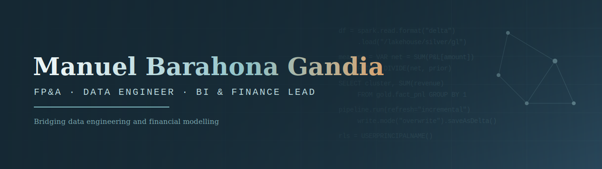

# manuelbarahona.github.io

Personal portfolio of **Manuel Barahona Gandia** — FP&A · Data Engineer · BI & Finance Lead.

🔗 **Live site:** https://manuelbarahona.github.io

A hybrid profile bridging data engineering and financial modelling, with experience across
fund services, private equity, real estate and aviation services. The site showcases selected
Power BI and data-platform work built on synthetic, non-confidential data.

## Built with

- Handwritten HTML, CSS and vanilla JavaScript — no frameworks
- Animated canvas network background, glassmorphism UI, scroll-reveal and micro-interactions
- Hosted free on GitHub Pages

## Skills highlighted

SQL · Python · Power BI · Microsoft Fabric · Power Query (M) · DAX · lakehouse / medallion
architecture · PySpark & Delta ETL · semantic modelling · row-level security · executive reporting

## Contact

- LinkedIn: https://www.linkedin.com/in/manuel-barahona-gandía-9187a541/
- Email: cosladacity@gmail.com

---

© 2026 Manuel Barahona Gandia
